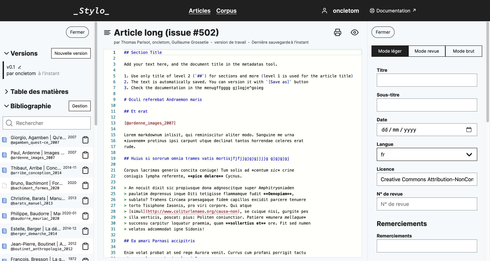
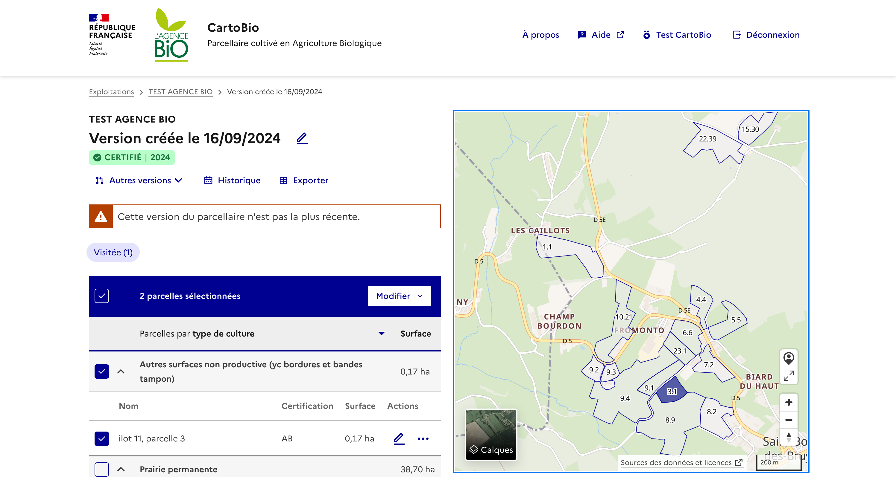
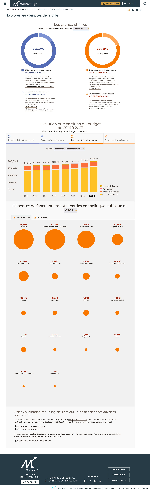
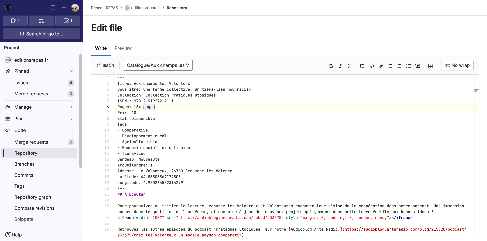
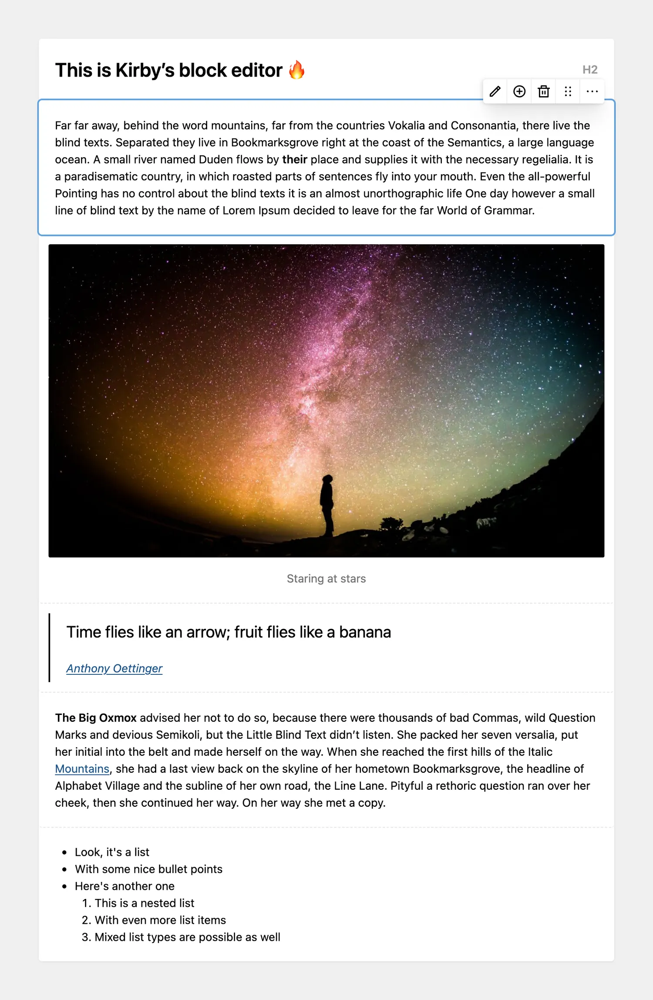
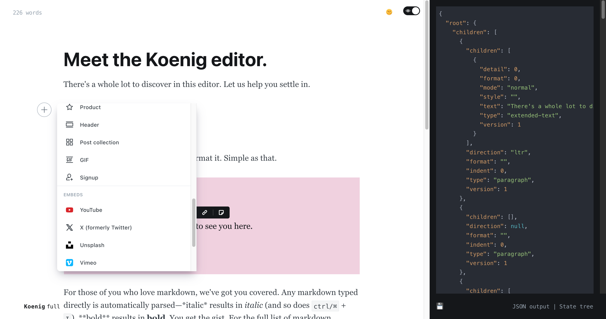
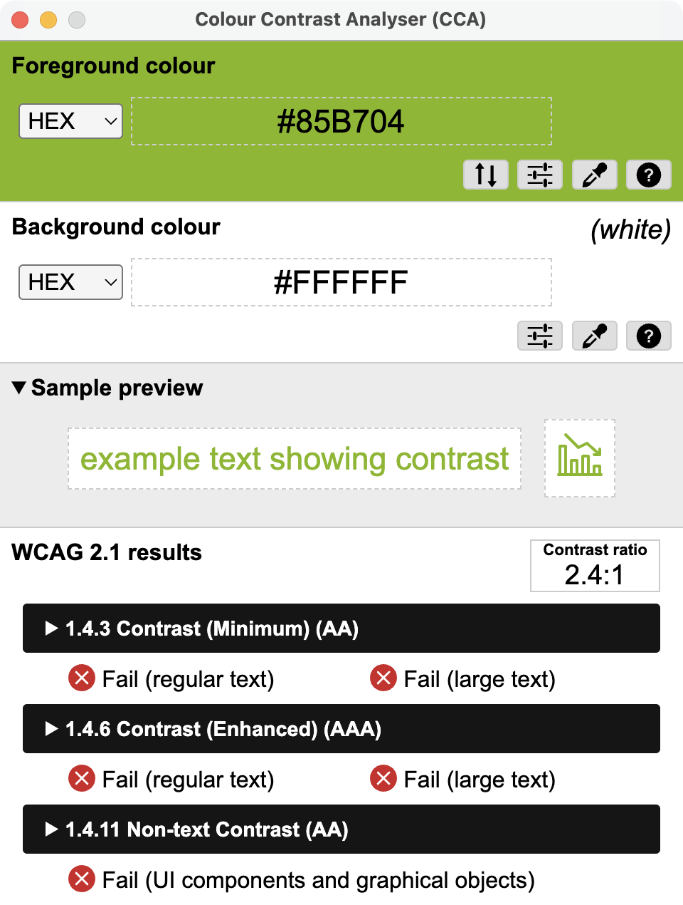
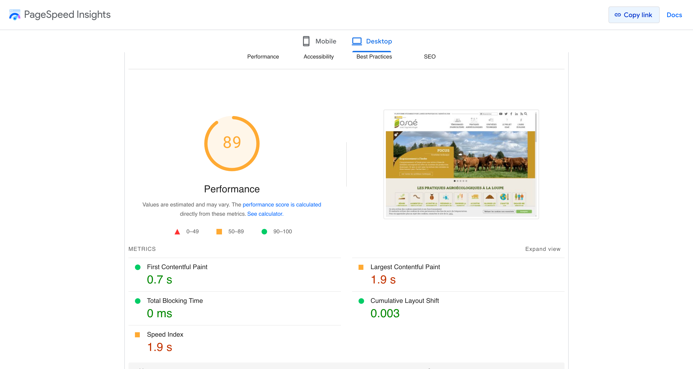
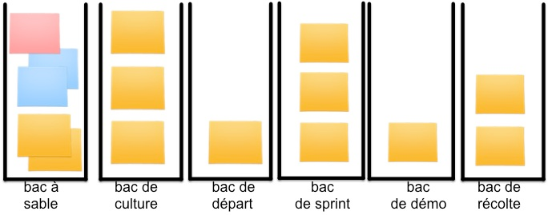

Réponse de [Thomas Parisot](https://détour.studio),
entrepreneur-salarié dans la [Coopérative d’Activité Solstice SCOP](https://solstice.coop).

## Compréhension du contexte

L’entreprise-association Solagro souhaite actualiser une de ses présences en ligne — [Osez l’agroécologie](https://osez-agroecologie.org) — lors du premier semestre de l’année 2025.

Pionnière d'une documentation de terrain sur l'agroécologie, Solagro est désormais en concurrence avec d'autres acteurs sur les volets de la formation professionnelle, de l'information et de la production scientifique. On peut nommer [Pour une agriculture du vivant](https://agricultureduvivant.org), le [Centre de développement de l'agroécologie](https://centre-developpement-agroecologie.fr/), [Terre Solidaire](https://ccfd-terresolidaire.org) ou encore le [Centre national d'agroécologie](https://centre-national-agroecologie.fr/).

Il y a des enjeux d'image (être identifié·e comme _leaders_), de contenus (être la _référence_ de terrain) et de modèle économique.

Solagro ambitionne une refonte à la hauteur de sa démarche écoresponsable : matériel peu énergivore, réduction des gaz à effet de serre et tout effort réduisant ses impacts sur notre environnement immédiat et distant.

## Présentation du candidat

Thomas Parisot a développé une **expertise dans le développement web depuis plus de 20 ans** en service informatique, en agence web, en start-up, en R&D, dans les services publics français (DINUM/beta.gouv.fr) et britanniques (BBC).

Depuis 2013, Thomas privilégie les projets _open source_ et œuvrant pour la connaissance ou un monde environnementalement désirable.

Thomas participe régulièrement aux communautés indépendantes [Paris Web](https://www.paris-web.fr/) (qualité, accessibilité), [MiXiT](https://mixitconf.org/) (développement, organisation du travail) et [PrePostPrint](https://prepostprint.org/) (impression expérimentale libre) en tant que participant ou orateur.

Thomas a publié deux livres ([Réussir son blog professionnel](https://www.eyrolles.com/Informatique/Livre/reussir-son-blog-professionnel-image-communication-et-influence-a-la-portee-de-9782212127683/) chez Eyrolles en 2008 et [Node.js](https://www.eyrolles.com/Informatique/Livre/node-js-9782212139938/) chez Eyrolles en 2018) et un article scientifique ([Repenser les chaînes de publication par l’intégration des pratiques du développement logiciel](https://shs.cairn.info/revue-sciences-du-design-2018-2-page-45) dans Sciences du Design en 2018).

### Valeurs

Frugalité, écoute, ouverture.

### Expériences notables d'équipes multi-disciplinaires

**Stylo** — 2020—aujourd'hui
: Avec l'Université de Montréal
: Développeur d'une interface collaborative d'écriture textuelle.
: Développement d'une API GraphQL et d'intégrations avec des plateformes de publication.
: Propositions méthodologiques, d'amélioration de qualité et d'accessibilité.
: Techologies : React, Node.js, MongoDB, GraphQL, Docker, OAuth, HTML, CSS.
: [Code source ouvert](https://github.com/EcrituresNumeriques/stylo).

**CartoBio** — 2020–2024
: Avec l'Agence Bio
: Développeur d'un système d'audit cartographique et d'un système d'information partagé entre les organismes de certification, les fermes bio et l'instruction PAC.
: Développeur d'une API REST à haute disponibilité.
: Propositions techniques, mise en conformité accessibilité RGAA, recrutement des collègues et création d'un chemin d'intégration avec 10 organismes de certification.
: Techologies : Vue, Node.js, Postgres/PostGIS, MapLibre, Docker, GeoJSON, OAuth, HTML, CSS.
: [Code source ouvert](https://github.com/AgenceBio/cartobio-front).

**Finances territoriales** — 2018
: Avec la Ville de Montreuil
: Développeur d'une amélioration d'interface de parcours d'instructions financières avec la Direction des services financiers.
: Entretiens utilisateurs aléatoires dans plusieurs quartiers.
: Techologies : React, Node.js, SVG, HTML, CSS.
: [Code source ouvert](https://github.com/dtc-innovation/dataviz-finances-montreuil).

**BBC R&D** — 2013–2015
: _Lead_ technique d'une équipe expérimentant autour de la recommandation éditoriale.
: Développeur sur un outil de visualisation d'archives radiophoniques.
: Préfiguration d'un système de design partagé entre équipes.
: Techologies : React, Node.js, WebAudio, Amazon Web Services, Postgres, Docker.
: Partiellement [code source ouvert](https://github.com/bbc/peaks.js).

### À propos de la Coopérative Solstice

La SCOP Solstice (SIRET [43827938200040](https://annuaire-entreprises.data.gouv.fr/entreprise/438279382)) est une Coopérative d’Activité et d’Emploi (CAE) créée en 2001 et domiciliée à Eurre dans la Drôme (26), en plein cœur de la Vallée de la Drôme — biorégion pionnière de l’agriculture biologique, de pratiques agro-écologiques et agro-pastorales.

Solstice est une CAE généraliste. Elle est composée d’une centaine d’entrepreneurs qui mutualisent des services juridiques, administratifs et financiers tout en étant à la fois responsables de leur activité économique et solidaires de leurs pairs. Ils et elles exercent des activités de conseil et de formation (40%), de santé et bien-être (20%), de design et de développement logiciel (13%), des activités diverses (19%) ainsi que de l’artisanat et du commerce (8%).\
Le capital de la coopérative est entièrement détenu par ses salariés et deux autres coopératives régionales — Cabestan et Natura SCOP.

Solstice est labellisée Qualiopi (formation professionnelle et bilans de compétence), Économie Sociale et Solidaire, et Crédit Impôt Recherche (pour la période 2022–2024).

### En savoir plus

* [Carnet d'écriture](https://thom4.net/)
* [Site professionnel](https://détour.studio)
* [Compte GitHub](https://github.com/thom4parisot)

## Proposition fonctionnelle

### Gestionnaire de contenus modulaire

J'identifie l'enjeu majeur de cette refonte autour de l'**outil technique de contribution éditoriale**.
C'est l'outil qui déterminera l'interconnexion avec les autres sites de contenus de Solagro. C'est pourquoi je propose de tendre vers un **typage fort** des contenus.

Le typage fort consiste à **structurer avec précision** chacune des entrées de contenus (témoignages, vidéos, actualités, fiches pratiques, actualités, événéments, etc.). Ça améliore la qualité de leur indexation dans un moteur de recherche et de fait, les recommandations de contenus connexes.

Il y a peut-être également des enjeux de nomenclatures et d'ontologies des champs pour interconnecter les contenus à l'échelle de la galaxie Solagro, voire avec le monde de la recherche scientifique.

Les différentes pistes ci-après emmènent par des chemins différents, à tester et à éprouver avec les personnes amenées à publier des contenus.

Elles ont en commun :

- d'être en capacité à consommer des contenus tiers provenants d'autres sites et d'autres API ;
- d'exposer des contenus consommables par d'autres outils et API ;
- de s'interconnecter avec d'autres outils de publication (newsletter, réseaux sociaux propriétaires et fédérés, etc.) ;
- d'être éprouvées dans le temps, avec une bonne documentation et une communauté mâture.

Je ne propose volontairement pas de WordPress, de Joomla ou de Drupal. Ces solutions sont trop gourmandes en ressources informatiques, en temps de maintenance et en failles de sécurité.

#### Option 1 : ultra-frugalité open source avec Eleventy

* Site web : [11ty.dev](https://www.11ty.dev/)
* Licence : open source
* Tarif : gratuit
* Technologie : HTML via JavaScript / Node.js

Cet outil fonctionne sans base de données et déploie une nouvelle version du site seulement en cas de changement au niveau des contenus. C'est un des outils les plus véloces qui soient d'un point de vue de navigation. Il ne nécessite pas de mise à jour et n'est pas susceptible d'être vulnérable à des failles de sécurité une fois en ligne.

Tout hébergeur est susceptible d'accueillir les contenus, y compris sur des machines recyclées chez [DeuxFleurs](https://deuxfleurs.fr/).

#### Option 2 : tout-en-un propriétaire avec KirbyCMS

* Site web : [getkirby.com](https://getkirby.com/)
* Licence : propriétaire
* Tarif : 99$ à vie / site
* Technologie : PHP

Kirby propose une structuration du contenu très au point, le tout dans une interface épurée et une grande rapidité d'exécution. Il est très flexible, extensible et fonctionne sans base de données, tout comme Eleventy.

Un hébergeur comme OVH ou Scaleway sur une offre minimaliste suffit.

#### Option 2 : tout-en-un open source avec Ghost CMS

* Site web : [ghost.org](https://ghost.org)
* Licence : open source
* Tarif : gratuit (en mode auto-hébergé)
* Technologie : JavaScript / Node.js

Ghost est un beau projet qui mâture depuis une dizaine d'années. L'outil se nourrit régulièrement de nouvelles fonctionnalités pour améliorer la publication de contenus sous différentes formes, que ça soit des actualités, des newsletters ou sur des supports externes (comme LinkedIn, Instagram, etc.).

Un hébergeur comme OVH ou Scaleway sur un VPS à minimum 1Go de RAM est recommandé.

### Moteur de recherche

Les trois pistes proposées peuvent être des choix, ou des étages, selon la mâturité de réflexion au sein de Solagro.

#### Option 1 : open source et sans appels Internet

Les trois outils de contribution cités ci-dessus sont suffisamment maléables pour créer un moteur de recherche embarqué à même la page. Des outils _open source_ comme [Fuse.js](https://www.fusejs.io/) indexent le contenu à même la page, et permettent une recherche hors-ligne, sans interroger de serveur.

C'est une bonne première marche avant de choisir tout autre outil à installer sur un serveur.

#### Option 2 : service en ligne propriétaire type [Algolia](https://www.algolia.com/fr/)

Algolia est un des leaders du marché des moteurs de recherche ultra-performant.
Son tarif est léger. Sa version gratuite pourrait peut-être convenir à l'indexation de tous les contenus d'Osaé.

La constitution d'un _index_ par site pourrait à terme permettre d'utiliser un même outil pour créer un méta-moteur, accessible depuis tous les sites de la galaxie Solagro.

#### Option 3 : service open source auto-hébergé type [Typesense](https://typesense.org/)

Typesense est un outil autonome. Un routine pour chaque site Solagro sera en charge d'aller indexer / déposer les contenus. Ils sont ensuite requêtables et configurables très finement.

Un hébergeur comme OVH ou Scaleway sur un VPS à minimum 1Go de RAM est recommandé.

### Cartographie vectorielle avec MapLibre

[MapLibre](https://maplibre.org/) est une solution éprouvée de conception de cartographie sur-mesure performante. Les fonds de carte vectoriel et ortophotographiques de l'IGN, sous licence open data, devraient suffire à mettre en valeur les données cartographiques de Solagro.

Les données peuvent être produites / transformées au format GeoJSON pour une réutilisation sur d'autres sites de la galaxie Solagro.

### Des PDF basés sur des technologies web

[Paged.js](https://pagedjs.org/) est une tentative d'apporter les styles d'impressions paginés directement dans nos navigateurs web, plutôt habitués aux flux continus.

On peut envisager de produire des documents téléchargeables soit à la volée depuis le navigateur, soit de les constituer une fois, préparés à l'avance. Peut-être que le choix est à arbitrer en fonction des statistiques d'usages et de repartage sur d'autres réseaux sociaux et plateformes de contenus.

### Migration scriptée des contenus

On peut envisager d'automatiser la migration des contenus vers la plate-forme de publication retenue après une première exploration de la base de données des contenus actuels.

En l'état, il est difficile de se prononcer sur leur qualité et le temps de retraitement nécessaire.

Dans tous les cas, cette migration sera automatisée. Il y aura surement des retouches manuelles à prévoir pour les qui n'auraient pu être nettoyés totalement pendant le process.

### Viser 100% de conformité accessibilité RGAA

La proposition de design graphique n'est pas accessible. Au bas mot, les contrastes de couleurs combinées à l'épaisseur des caractères ne sont pas conforme au [Référentiel général d'amélioration de l'accessibilité](https://accessibilite.numerique.gouv.fr/). On parle autant de handicap que de situations de vie où nos perceptions sont affaiblies : l'âge, le matériel informatique en notre possession, notre mobilité des membres.

Je propose de viser une intégration HTML/CSS de la maquette pour que le résultat soit au plus près d'une conformité totale avec le RGAA. Ce qui est également une bonne nouvelle pour le référencement des contenus par les moteurs de recherche. Il faudra probablement envisager des concessions et peut-être retravailler les choix graphiques.

Par ailleurs, je suis inscrit à la session de formation / certification [développer des sites web accessibles et conformes au RGAA](https://a42.fr/dev) organisée par la  [Scop Access42](https://access42.net/) fin janvier 2025. J'ai pour volonté d'actualiser et de consolider mes connaissances en la matière.

### Des temps de chargement inférieurs à 1 seconde

La page d'accueil actuelle d'Osaé pèse environ 6 mégaoctets. Il n'y a pas de raison d'atteindre 1 mégaoctet et d'en attendre le moindre chargement au-delà d'une seconde.

Peut-être que ça aura des incidences sur la proposition de design, pour l'alléger en éléments graphiques à charger (je pense surtout à la page d'accueil).

## Proposition méthodologique

Je propose de s'inspirer du [manifeste agile](https://manifesteagile.fr) :

- en articulant la refonte en mode pas à pas ;
- en priorisant la qualité à l'exhaustivité/rapidité ;
- en se concentrant sur ce qu'il y a de plus important en terme d'usage.

La documentation des _persona_ sera un bon guide pour se projeter.
Les rituels de démonstration (voir ci-après) nous aideront à éprouver le travail accompli, à l'offrir à d'autres yeux moins impliqués et tout autant concernés.

Les rituels de priorisation seront des moments clés pour décider du cap
et des ajustements à discuter/décider pour utiliser au mieux de l'utilisation du budget
au vu des objectifs de cette refonte.

Cette méthodologie demande une implication de toutes les parties prenantes
ainsi qu'une communication claire et explicite.

### Prioriser avec Scrum

La méthologie scrum considère 3 rituels importants pour guider la qualité des projets :

- le rituel de **priorisation** : clarifier (qu'est-ce qu'on fait ?), déterminer (le début et la fin de chaque action) et ordonner (ce qui est important et l'est moins), ensemble pour fonctionner en équipe de manière explicite ;
- le rituel de **démonstration** : ça clôture une séquence de travail (de deux ou trois semaines) pour faire état des avancées, montrer les choses dans leur état actuel (pas forcément l'état idéal) et constater qu'on avance… ou au contraire, qu'on a rencontré des difficultés, des imprévus ;
- le rituel de **rétrospective** : c'est le temps qu'on prend pour se retrouver, célébrer les réussites, se dire ce qui a moins bien marcher et programmer des changements qui bonifieraient notre manière de travailler ensemble.

On nomme **itération** une séquence de travail ouverte par une _priorisation_ et clôturée par une _démo_ et éventuellement une _rétrospective_.

Nous programmerons la fréquence de ces temps en fonction de nos rythmes de travail respectifs.

### Suivi des actions avec Kanban

Kanban est un flux de travail de gauche à droite, de l'état du _moins fini_ jusqu’à ce qui est _prêt à être mis en ligne_.
Chaque colonne peut être vue comme un bac, c’est-à-dire un espace de stockage avec une capacité limitée de travail possible (notre temps est _fini_).
Les items placés en haut sont les plus prioritaires, et inversement pour ceux qui sont placés au fond du bac (ça aiderait à discerner les éléments qui stagnent entre les itérations).

On pourrait considérer ces bacs :

- **bac à sable** : des idées et choses à faire pour plus tard, avec un peu de matière… mais on ne sait pas encore trop.
- **bac de culture** : ces items sont à affiner pour que les attentes et les résultats attendus soient clairs.
- **bac de départ** : ces items sont prêts à être planifiés.
- **bac d’itération** : ces items sont à traiter de haut en bas dans l’itération courante.
- **bac de démo** : ces items sont prêts à être testés ou montrés lors d’une session de restitution.
- **bac de récolte** : ces items sont prêts à déployés en production.

Le backlog est alimenté pendant le rituel de planification.
Il est actualisé au fur et à mesure de l’itération pour rendre disponible à tout moment l'état d'avancement du projet à toute l'équipe.

")

### Code source ouvert et déploiement continu

Ma philosophie est de déployer un brouillon le plus tôt possible.
Puis de regarder la graine germer au fur et à mesure des changements,
d'affiner les idées lors des rituels et de reprioriser en fonction de nos constats respectifs.

Finalement, ce n'est pas si différent que ça de l'agroécologie.
Mais appliqué à du développement informatique.

La proposition est également de fonctionner en code source ouvert,
d'une part dans une démarche d'exemplarité mais aussi pour éviter toute ambiguïté quant
à la propriété intellectuelle. Vous gouvernez chaque ligne de code dès la première heure de travail fournie. Et vous conservez tout, peu importe quand le projet aboutit et qu'il se réalise avec un seul ou plusieurs prestataires.

## Propositions financière

Je propose de facturer à un tarif militant de 500€ HT par journée de travail.
Je ne facture que des journées de travail dont je suis satisfait de la valeur apportée au projet.

La facturation peut se faire par lot — temporel, fonctionnel ou itération.
Je considère la facture comme un livrable de clôture, dont le temps de traitement administratif reflète la bonne entente entre les parties prenantes.

Également, je n'ai pas l'intention de facturer autre chose que le travail réalisé : s'il reste du budget alors qu'on a tout réalisé, Solagro décide de son usage (nouvelles fonctionnalités, mise en réserve pour plus tard, etc.).\
À l'inverse, s'il y a davantage de choses à réaliser que ce que le budget permet effectivement de réaliser, les rituels de priorisation prendront d'autant plus d'importance qu'ils concentrent la responsabilité des décisions (dans quelle valeur projet investir le budget restant ?) ainsi qu'un principe de réalité (compte tenu qu'on a davantage de besoins que de budget, comment fait-on ?).

Je propose d'entamer le projet en se retrouvant physiquement pendant 1 journée (même journée, ou 2 demi-journées), pourquoi pas dans vos locaux à Toulouse.
C'est l'occasion de prendre le poul de l'ambiance et du contexte de Solagro, pour mieux travailler ensemble.

### Développement web et déploiement

Je favorise les solutions pragmatiques, qualitatives et maintenables à long terme.

Je propose de partir sur un budget temps-travail de 14 jours

Également, je propose de provisionner 1 jour pour de l'évaluation / corrections d'accessibilité. C'est une manière de rendre visible un effort trop souvent relégué en arrière-plan parce que "pas prioritaire" (alors que demandé dans le cahier des charges et légalement obligatoire).

### Maintenance

Étant donné que je propose des solutions frugales, elles comportent peu de besoin en maintenance. On peut envisager de partir sur un budget maintenance d'une demi-journée par semestre, et d'ajuster en fonction de la réalité.

### En option : formation-action sur un budget éligible Qualiopi

La documentation sera rédigée par les contributeur‧ices du site au fur et à mesure
dans un objectif d'appropriation (on apprend en écrivant) et de choix adapté du langage écrit/lu. L'écriture se fera à même l'outil de contribution, en binôme avec moi au début, et de manière de plus en plus autonome.

Cette approche a été utilisée avec succès par les [Éditions REPAS](https://editionsrepas.fr) ([code source](https://framagit.org/reseau-repas/editionsrepas.fr)) et le [Compagnonnage REPAS](https://compagnonnage-repas.org) ([code source](https://framagit.org/reseau-repas/compagnonnage-repas.org)).
Ça ne m'a pas demandé plus d'1 heure de maintenance en 2 ans.

Éventuellement, un temps structuré de formation peut être conçu, organisé et financé par un Opérateur de Compétences (Opco) du fait de la certification Qualiop de ma coopérative d'activités.

---

Ceci est une proposition.
Comme toute proposition, je suis ouvert à en discuter chacun des points pour apporter de la clarté, répondre aux questions et éprouver notre capacité à travailler ensemble.

Bonne lecture,

Thomas
